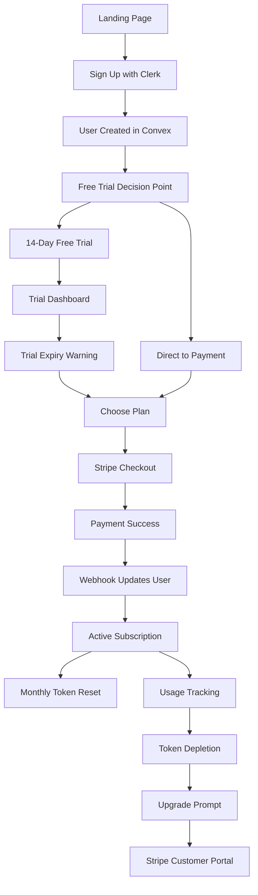

# Stripe Integration Plan for QuantiPackAI

## Executive Summary
This document outlines the complete Stripe payment integration architecture for QuantiPackAI, including product structure, subscription management, token system, and implementation details.

## 1. Business Model Analysis

### Current Token Consumption Points
Each of these actions consumes 1 token:
1. **Suite Analyzer** - `convex/suiteAnalyzerBackend.ts::startSuiteAnalysis`
2. **Spec Generator** - `convex/specGenerator.ts::generateSpecs`
3. **Demand Planner** - `convex/demandPlanner.ts::calculateDemandPlanning`
4. **PDP Analyzer** - `convex/pdpAnalyzer.ts::analyzePDP`

### Pricing Tiers
- **Starter**: $39.99/month (50 tokens)
- **Professional**: $99.99/month (150 tokens)
- **Enterprise**: Custom pricing (flexible tokens)

## 2. Complete User Journey Flow



## 3. Stripe Product Structure

### Products in Stripe Dashboard

```javascript
// Products (create once in Stripe Dashboard)
{
  "products": [
    {
      "id": "prod_starter",
      "name": "QuantiPackAI Starter",
      "description": "50 tokens per month for small businesses",
      "metadata": {
        "tokens_per_month": "50",
        "plan_type": "individual"
      }
    },
    {
      "id": "prod_professional",
      "name": "QuantiPackAI Professional",
      "description": "150 tokens per month for growing businesses",
      "metadata": {
        "tokens_per_month": "150",
        "plan_type": "corporate"
      }
    },
    {
      "id": "prod_enterprise",
      "name": "QuantiPackAI Enterprise",
      "description": "Custom token packages for large organizations",
      "metadata": {
        "tokens_per_month": "custom",
        "plan_type": "enterprise"
      }
    }
  ]
}

// Prices (recurring subscriptions)
{
  "prices": [
    {
      "id": "price_starter_monthly",
      "product": "prod_starter",
      "unit_amount": 3999, // $39.99
      "currency": "usd",
      "recurring": { "interval": "month" }
    },
    {
      "id": "price_starter_yearly",
      "product": "prod_starter",
      "unit_amount": 31900, // $319.00 (20% discount)
      "currency": "usd",
      "recurring": { "interval": "year" }
    },
    {
      "id": "price_professional_monthly",
      "product": "prod_professional",
      "unit_amount": 9999, // $99.99
      "currency": "usd",
      "recurring": { "interval": "month" }
    },
    {
      "id": "price_professional_yearly",
      "product": "prod_professional",
      "unit_amount": 79900, // $799.00 (20% discount)
      "currency": "usd",
      "recurring": { "interval": "year" }
    }
  ]
}
```

### One-Time Token Packages (Add-ons)

```javascript
{
  "products": [
    {
      "id": "prod_token_pack_small",
      "name": "25 Additional Tokens",
      "description": "One-time token package",
      "metadata": {
        "tokens": "25"
      }
    },
    {
      "id": "prod_token_pack_medium",
      "name": "50 Additional Tokens",
      "description": "One-time token package",
      "metadata": {
        "tokens": "50"
      }
    },
    {
      "id": "prod_token_pack_large",
      "name": "100 Additional Tokens",
      "description": "One-time token package",
      "metadata": {
        "tokens": "100"
      }
    }
  ],
  "prices": [
    {
      "id": "price_token_pack_small",
      "product": "prod_token_pack_small",
      "unit_amount": 2500, // $25.00
      "currency": "usd"
    },
    {
      "id": "price_token_pack_medium",
      "product": "prod_token_pack_medium",
      "unit_amount": 4500, // $45.00
      "currency": "usd"
    },
    {
      "id": "price_token_pack_large",
      "product": "prod_token_pack_large",
      "unit_amount": 8000, // $80.00
      "currency": "usd"
    }
  ]
}
```

## 4. Database Schema Updates

### New Tables Required

```typescript
// convex/schema.ts additions

subscriptions: defineTable({
  userId: v.id("users"),
  stripeCustomerId: v.string(),
  stripeSubscriptionId: v.string(),
  stripePriceId: v.string(),
  status: v.union(
    v.literal("trialing"),
    v.literal("active"),
    v.literal("canceled"),
    v.literal("incomplete"),
    v.literal("incomplete_expired"),
    v.literal("past_due"),
    v.literal("unpaid"),
    v.literal("paused")
  ),
  planType: v.union(
    v.literal("individual"),
    v.literal("corporate"),
    v.literal("enterprise")
  ),
  currentPeriodStart: v.number(),
  currentPeriodEnd: v.number(),
  cancelAtPeriodEnd: v.boolean(),
  trialEnd: v.optional(v.number()),
  createdAt: v.number(),
  updatedAt: v.number(),
})
  .index("by_user", ["userId"])
  .index("by_stripe_subscription", ["stripeSubscriptionId"])
  .index("by_stripe_customer", ["stripeCustomerId"]),

tokenBalances: defineTable({
  userId: v.id("users"),
  subscriptionId: v.id("subscriptions"),
  monthlyAllocation: v.number(), // Base tokens from subscription
  additionalTokens: v.number(),   // Purchased token packs
  usedTokens: v.number(),         // Consumed this period
  remainingTokens: v.number(),    // Available tokens
  resetDate: v.number(),          // Next reset date
  lastUpdated: v.number(),
})
  .index("by_user", ["userId"])
  .index("by_subscription", ["subscriptionId"]),

tokenTransactions: defineTable({
  userId: v.id("users"),
  type: v.union(
    v.literal("allocation"),    // Monthly reset
    v.literal("purchase"),      // Token pack purchase
    v.literal("consumption"),   // Token used
    v.literal("refund"),       // Refunded tokens
    v.literal("adjustment")     // Manual adjustment
  ),
  amount: v.number(),           // Positive for credits, negative for debits
  balance: v.number(),          // Balance after transaction
  description: v.string(),
  metadata: v.optional(v.any()), // Analysis ID, Stripe payment intent, etc.
  createdAt: v.number(),
})
  .index("by_user", ["userId"])
  .index("by_type", ["type"])
  .index("by_date", ["createdAt"]),

paymentMethods: defineTable({
  userId: v.id("users"),
  stripePaymentMethodId: v.string(),
  type: v.string(),           // card, bank_account, etc.
  last4: v.string(),
  brand: v.optional(v.string()), // visa, mastercard, etc.
  expiryMonth: v.optional(v.number()),
  expiryYear: v.optional(v.number()),
  isDefault: v.boolean(),
  createdAt: v.number(),
})
  .index("by_user", ["userId"])
  .index("by_stripe_id", ["stripePaymentMethodId"]),

invoices: defineTable({
  userId: v.id("users"),
  stripeInvoiceId: v.string(),
  stripeInvoiceNumber: v.string(),
  amountPaid: v.number(),
  currency: v.string(),
  status: v.string(),
  invoiceUrl: v.string(),
  pdfUrl: v.string(),
  createdAt: v.number(),
})
  .index("by_user", ["userId"])
  .index("by_stripe_id", ["stripeInvoiceId"]),
```

## 5. Webhook Events to Handle

### Critical Webhooks

```typescript
// convex/stripeWebhooks.ts

export const handleStripeWebhook = action({
  args: {
    event: v.any(),
    signature: v.string(),
  },
  handler: async (ctx, args) => {
    // Verify webhook signature
    const event = stripe.webhooks.constructEvent(
      args.event,
      args.signature,
      process.env.STRIPE_WEBHOOK_SECRET
    );

    switch (event.type) {
      // Subscription lifecycle
      case 'customer.subscription.created':
        await handleSubscriptionCreated(ctx, event.data.object);
        break;
      
      case 'customer.subscription.updated':
        await handleSubscriptionUpdated(ctx, event.data.object);
        break;
      
      case 'customer.subscription.deleted':
        await handleSubscriptionDeleted(ctx, event.data.object);
        break;
      
      // Payment events
      case 'invoice.payment_succeeded':
        await handlePaymentSucceeded(ctx, event.data.object);
        await resetMonthlyTokens(ctx, event.data.object);
        break;
      
      case 'invoice.payment_failed':
        await handlePaymentFailed(ctx, event.data.object);
        await suspendAccount(ctx, event.data.object);
        break;
      
      // Token pack purchases
      case 'checkout.session.completed':
        if (event.data.object.mode === 'payment') {
          await handleTokenPackPurchase(ctx, event.data.object);
        }
        break;
      
      // Customer updates
      case 'customer.updated':
        await updateCustomerInfo(ctx, event.data.object);
        break;
      
      // Payment method updates
      case 'payment_method.attached':
        await savePaymentMethod(ctx, event.data.object);
        break;
      
      case 'payment_method.detached':
        await removePaymentMethod(ctx, event.data.object);
        break;
    }
  },
});
```

## 6. Token Management System

### Token Enforcement Flow

```typescript
// convex/tokenManagement.ts

export const canUseToken = query({
  args: { userId: v.id("users") },
  handler: async (ctx, args) => {
    const balance = await ctx.db
      .query("tokenBalances")
      .withIndex("by_user", q => q.eq("userId", args.userId))
      .unique();
    
    if (!balance) return false;
    return balance.remainingTokens > 0;
  },
});

export const consumeToken = mutation({
  args: {
    userId: v.id("users"),
    analysisType: v.string(),
    analysisId: v.id("analyses"),
  },
  handler: async (ctx, args) => {
    // Get current balance
    const balance = await ctx.db
      .query("tokenBalances")
      .withIndex("by_user", q => q.eq("userId", args.userId))
      .unique();
    
    if (!balance || balance.remainingTokens <= 0) {
      throw new Error("Insufficient tokens");
    }
    
    // Deduct token
    await ctx.db.patch(balance._id, {
      usedTokens: balance.usedTokens + 1,
      remainingTokens: balance.remainingTokens - 1,
      lastUpdated: Date.now(),
    });
    
    // Record transaction
    await ctx.db.insert("tokenTransactions", {
      userId: args.userId,
      type: "consumption",
      amount: -1,
      balance: balance.remainingTokens - 1,
      description: `Used for ${args.analysisType}`,
      metadata: { analysisId: args.analysisId },
      createdAt: Date.now(),
    });
    
    return { success: true, remainingTokens: balance.remainingTokens - 1 };
  },
});
```

### Monthly Token Reset

```typescript
export const resetMonthlyTokens = mutation({
  args: { subscriptionId: v.id("subscriptions") },
  handler: async (ctx, args) => {
    const subscription = await ctx.db.get(args.subscriptionId);
    if (!subscription) return;
    
    const tokensPerMonth = getTokensForPlan(subscription.planType);
    
    const balance = await ctx.db
      .query("tokenBalances")
      .withIndex("by_subscription", q => q.eq("subscriptionId", args.subscriptionId))
      .unique();
    
    if (balance) {
      // Reset to monthly allocation + any remaining additional tokens
      await ctx.db.patch(balance._id, {
        monthlyAllocation: tokensPerMonth,
        usedTokens: 0,
        remainingTokens: tokensPerMonth + balance.additionalTokens,
        resetDate: Date.now() + 30 * 24 * 60 * 60 * 1000,
        lastUpdated: Date.now(),
      });
    }
    
    // Record reset transaction
    await ctx.db.insert("tokenTransactions", {
      userId: subscription.userId,
      type: "allocation",
      amount: tokensPerMonth,
      balance: tokensPerMonth + (balance?.additionalTokens || 0),
      description: "Monthly token allocation",
      createdAt: Date.now(),
    });
  },
});
```

## 7. Frontend Integration Points

### Checkout Flow

```typescript
// src/components/CheckoutButton.tsx
import { loadStripe } from '@stripe/stripe-js';

const stripePromise = loadStripe(import.meta.env.VITE_STRIPE_PUBLISHABLE_KEY);

export const CheckoutButton = ({ priceId, planName }) => {
  const { user } = useUser();
  const createCheckoutSession = useMutation(api.stripe.createCheckoutSession);
  
  const handleCheckout = async () => {
    const stripe = await stripePromise;
    
    const session = await createCheckoutSession({
      priceId,
      userId: user.id,
      successUrl: `${window.location.origin}/dashboard?payment=success`,
      cancelUrl: `${window.location.origin}/pricing`,
    });
    
    await stripe.redirectToCheckout({
      sessionId: session.id,
    });
  };
  
  return (
    <Button onClick={handleCheckout}>
      Subscribe to {planName}
    </Button>
  );
};
```

### Token Display Component

```typescript
// src/components/TokenBalance.tsx
export const TokenBalance = () => {
  const tokenBalance = useQuery(api.tokens.getBalance);
  
  if (!tokenBalance) return <Skeleton />;
  
  const percentageUsed = (tokenBalance.usedTokens / tokenBalance.monthlyAllocation) * 100;
  
  return (
    <Card>
      <CardHeader>
        <CardTitle>Token Balance</CardTitle>
      </CardHeader>
      <CardContent>
        <div className="space-y-4">
          <div className="flex justify-between">
            <span>Available</span>
            <span className="font-bold">{tokenBalance.remainingTokens}</span>
          </div>
          
          <Progress value={percentageUsed} />
          
          <div className="text-sm text-gray-600">
            Resets on {new Date(tokenBalance.resetDate).toLocaleDateString()}
          </div>
          
          {tokenBalance.remainingTokens < 5 && (
            <Alert>
              <AlertDescription>
                Running low on tokens. 
                <Link to="/billing">Purchase more tokens</Link>
              </AlertDescription>
            </Alert>
          )}
        </div>
      </CardContent>
    </Card>
  );
};
```

### Usage Guard Hook

```typescript
// src/hooks/useTokenGuard.ts
export const useTokenGuard = () => {
  const canUseToken = useQuery(api.tokens.canUseToken);
  const consumeToken = useMutation(api.tokens.consumeToken);
  
  const executeWithToken = async (
    analysisType: string,
    analysisFunction: () => Promise<any>
  ) => {
    // Check token availability
    if (!canUseToken) {
      toast.error("Insufficient tokens. Please upgrade your plan.");
      return { error: "INSUFFICIENT_TOKENS" };
    }
    
    try {
      // Execute the analysis
      const result = await analysisFunction();
      
      // Consume token after successful execution
      await consumeToken({
        analysisType,
        analysisId: result.analysisId,
      });
      
      return { success: true, result };
    } catch (error) {
      // Don't consume token if analysis fails
      console.error("Analysis failed:", error);
      return { error: error.message };
    }
  };
  
  return { executeWithToken, canUseToken };
};
```

## 8. Billing Portal Integration

```typescript
// convex/stripe.ts
export const createBillingPortalSession = action({
  args: { returnUrl: v.string() },
  handler: async (ctx, args) => {
    const identity = await ctx.auth.getUserIdentity();
    if (!identity) throw new Error("Not authenticated");
    
    const subscription = await ctx.db
      .query("subscriptions")
      .withIndex("by_user", q => q.eq("userId", identity.subject))
      .unique();
    
    if (!subscription) {
      throw new Error("No subscription found");
    }
    
    const session = await stripe.billingPortal.sessions.create({
      customer: subscription.stripeCustomerId,
      return_url: args.returnUrl,
    });
    
    return { url: session.url };
  },
});
```

## 9. Implementation Phases

### Phase 1: Foundation (Week 1)
1. Set up Stripe account and products
2. Install Stripe dependencies
3. Update database schema
4. Create webhook endpoint

### Phase 2: Subscription Flow (Week 2)
1. Implement checkout flow
2. Handle webhook events
3. Create subscription management
4. Test payment flows

### Phase 3: Token System (Week 3)
1. Implement token tracking
2. Add usage enforcement
3. Create token purchase flow
4. Build token UI components

### Phase 4: Customer Portal (Week 4)
1. Integrate Stripe billing portal
2. Add upgrade/downgrade flows
3. Implement invoice history
4. Create usage analytics

### Phase 5: Testing & Launch (Week 5)
1. End-to-end testing
2. Error handling
3. Documentation
4. Production deployment

## 10. Security Considerations

1. **Webhook Verification**: Always verify Stripe webhook signatures
2. **API Keys**: Store keys securely in environment variables
3. **PCI Compliance**: Use Stripe Elements/Checkout, never handle card details
4. **Rate Limiting**: Implement rate limiting on API endpoints
5. **Audit Trail**: Log all payment and token transactions
6. **Encryption**: Encrypt sensitive customer data
7. **HTTPS**: Ensure all payment flows use HTTPS
8. **Error Handling**: Never expose internal errors to users

## 11. Monitoring & Analytics

### Key Metrics to Track
- Monthly Recurring Revenue (MRR)
- Churn rate
- Token usage patterns
- Conversion rates
- Failed payment recovery
- Average Revenue Per User (ARPU)

### Alerts to Set Up
- Failed payments
- Unusual token consumption
- Subscription cancellations
- Webhook failures
- Low token balance warnings

## 12. Testing Checklist

- [ ] New user signup → trial → subscription
- [ ] Existing user upgrade/downgrade
- [ ] Token consumption and enforcement
- [ ] Monthly token reset
- [ ] Token pack purchases
- [ ] Payment failure handling
- [ ] Subscription cancellation
- [ ] Billing portal access
- [ ] Invoice generation
- [ ] Webhook processing
- [ ] Free trial expiration
- [ ] Edge cases (multiple tabs, race conditions)

## Conclusion

This comprehensive Stripe integration will transform QuantiPackAI into a fully monetized SaaS platform with robust subscription management, token-based usage tracking, and seamless payment processing. The architecture ensures scalability, security, and excellent user experience while maintaining flexibility for future enhancements.