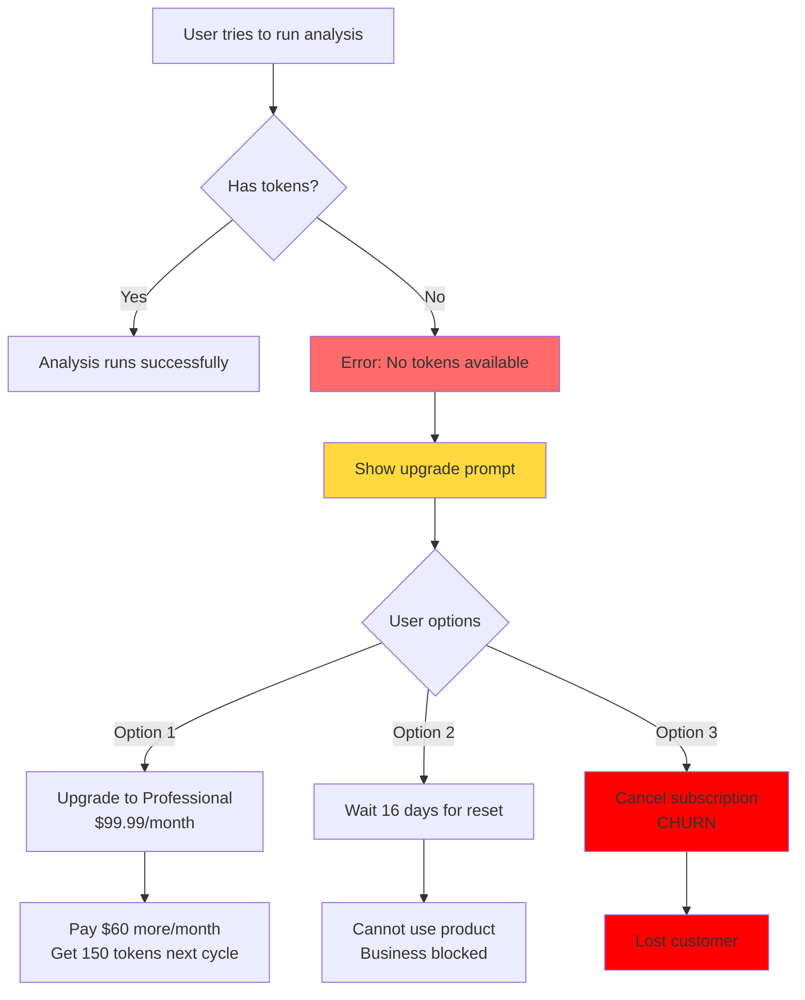

# Token Depletion Mid-Month: Analysis & Recommendations

**Document Purpose:** Analyze what happens when users exhaust their monthly token allocation before their billing cycle ends, and provide strategic recommendations for handling this scenario.

**Last Updated:** 2025-01-08
**Status:** For Partner Review & Decision

---

## Executive Summary

**Critical Finding:** Users who exhaust their monthly tokens mid-cycle have NO option to purchase additional tokens. They must either upgrade their entire subscription plan or wait for the monthly reset, both of which create poor user experience and potential churn risk.

**Business Impact:**
- **Revenue Loss:** Users willing to spend $25-$80 on token packs have no purchase path
- **Churn Risk:** Users may cancel subscriptions if they can't use the product when needed
- **Competitive Disadvantage:** Most SaaS products offer flexible top-up options

**Decision Required:** Should we implement mid-month token purchase capability?

---

## 1. Current System Architecture

### Token Balance Structure

```typescript
tokenBalance {
  monthlyTokens: 50,        // From subscription (Starter: 50, Pro: 150)
  additionalTokens: 0,      // Purchased token packs (NOT IMPLEMENTED)
  usedTokens: 50,           // Consumed this period
  remainingTokens: 0,       // monthlyTokens + additionalTokens - usedTokens
  resetDate: 1738828800000  // Next billing cycle (30 days)
}
```

### Token Calculation
```
Available Tokens = monthlyTokens + additionalTokens - usedTokens
```

### Current Subscription Plans
| Plan | Price/Month | Monthly Tokens | Target Audience |
|------|-------------|----------------|-----------------|
| Starter | $39.99 | 50 | Small businesses |
| Professional | $99.99 | 150 | Growing businesses |
| Enterprise | Custom | Unlimited | Large organizations |

### Token Consumption Rate
- **Each analysis costs 1 token:**
  - Suite Analyzer: 1 token
  - Spec Generator: 1 token
  - PDP Analyzer: 1 token
  - Demand Planner: 1 token

---

## 2. The Problem Scenario

### Real-World Example

**User Profile:**
- Subscription: Starter Plan ($39.99/month, 50 tokens)
- Billing cycle: January 1 - January 31
- Current date: January 15 (halfway through month)

**Token Usage:**
- Week 1 (Jan 1-7): Used 20 tokens
- Week 2 (Jan 8-14): Used 30 tokens
- **Current balance: 0 tokens remaining**
- **Next reset: January 31 (16 days away)**

**User Need:**
- Has urgent project requiring 10 more analyses
- Willing to pay for additional tokens
- Cannot wait 16 days

### Current User Experience



### What Users See

**Billing Page Alert:**
```
🚨 You've reached your token limit for this month.
   Upgrade to continue using QuantiPackAI.

   [Upgrade to Professional] button
```

**Analysis Page:**
```
❌ No tokens available
   You need tokens to run analyses. Please upgrade your plan.

   [Upgrade] button
```

---

## 3. Current Limitations Analysis

### What EXISTS in the Codebase

✅ **Database Structure:**
- `additionalTokens` field exists in tokenBalance table
- Token calculation includes additionalTokens
- Schema supports this feature

✅ **Token Management:**
- consumeToken() function works correctly
- refundToken() function handles failures
- Token balance queries include additionalTokens

✅ **Stripe Integration:**
- Checkout session creation (for subscriptions)
- Webhook handling infrastructure
- Customer creation and management

### What's MISSING

❌ **No Token Pack Products:**
- No Stripe products created for token packs
- No price IDs configured
- No environment variables set

❌ **No Purchase Flow:**
- No UI for token pack selection
- No checkout function for one-time purchases
- No "Buy Tokens" button anywhere

❌ **No Webhook Handler:**
- No code to handle one-time payment completion
- No function to add tokens to additionalTokens
- No transaction recording for token purchases

❌ **No User Communication:**
- UI doesn't mention token packs as an option
- No pricing for token packs displayed
- No education about this feature

---

## 4. User Impact Analysis

### Negative Impacts of Current System

**1. Financial Barrier to Entry**
- User needs 10 more tokens (~$10 value at $1/token)
- Forced to upgrade subscription ($60/month increase)
- 600% cost increase for short-term need

**2. Business Disruption**
- User cannot complete urgent projects
- May need to use competitor tools
- Loses trust in platform reliability

**3. Subscription Churn Risk**
- Users may downgrade after forced upgrade
- May cancel entirely due to inflexibility
- Negative reviews about "no flexibility"

**4. Revenue Loss**
- User willing to spend $25-$80 on tokens
- No way to capture this revenue
- Lost upsell opportunities

### Competitive Landscape

**How Competitors Handle This:**

| Platform | Mid-Cycle Purchase | Pricing Model |
|----------|-------------------|---------------|
| OpenAI API | ✅ Pay-as-you-go | $0.002 per request |
| Anthropic Claude | ✅ Top-up credits | Flexible |
| Google Cloud AI | ✅ On-demand billing | Per-use |
| **QuantiPackAI** | ❌ **NO OPTION** | **Subscription only** |

**Industry Standard:** Most SaaS platforms offer flexible token/credit purchasing.

---

## 5. Proposed Solutions

### Option A: Implement Token Pack Purchases (RECOMMENDED)

**What It Is:**
Allow users to purchase one-time token packs at any time, added to their additionalTokens balance.

**Proposed Pricing:**

| Pack Size | Price | Per-Token Cost | Best For |
|-----------|-------|----------------|----------|
| 25 tokens | $25.00 | $1.00 | Quick top-up |
| 50 tokens | $45.00 | $0.90 | Power users |
| 100 tokens | $80.00 | $0.80 | Large projects |

**Pricing Strategy Rationale:**
- 25 tokens: $1.00/token (baseline price)
- 50 tokens: $0.90/token (10% discount for larger pack)
- 100 tokens: $0.80/token (20% discount for bulk)
- All prices lower than per-token cost of upgrading subscription

**Business Benefits:**
- ✅ Capture revenue from users needing occasional extra tokens
- ✅ Reduce churn by providing flexibility
- ✅ Increase customer satisfaction
- ✅ Competitive with industry standards
- ✅ Low implementation effort (infrastructure exists)

**User Benefits:**
- ✅ Pay only for what they need
- ✅ No subscription commitment
- ✅ Immediate access to analyses
- ✅ Budget-friendly for occasional heavy usage

**Technical Complexity:** LOW
- Database fields already exist
- Token calculation already handles additionalTokens
- Just need: UI, Stripe products, webhook handler

**Estimated Implementation:** 2-3 days
- Day 1: Create Stripe products, backend checkout function
- Day 2: Build UI for token pack selection
- Day 3: Testing and deployment

---

### Option B: Introduce "Overage" Billing

**What It Is:**
Allow users to consume tokens beyond their limit, then bill them at month-end for overages.

**Pricing Example:**
- Base plan: $39.99 for 50 tokens
- Overage rate: $1.50 per additional token
- User uses 65 tokens → Charged $39.99 + ($1.50 × 15) = $62.49

**Pros:**
- ✅ Users never blocked from using product
- ✅ Automatic revenue capture
- ✅ Common in telecom/cloud services

**Cons:**
- ❌ Users may be surprised by bills
- ❌ Harder to predict monthly costs
- ❌ Requires overage billing infrastructure
- ❌ More complex accounting
- ❌ Risk of customer disputes

**Technical Complexity:** MEDIUM-HIGH
**Estimated Implementation:** 1-2 weeks

---

### Option C: "Rollover" Unused Tokens

**What It Is:**
Allow unused tokens to carry over to next month (up to a limit).

**Example:**
- Month 1: User has 50 tokens, uses 30
- Month 2: User gets 50 + 20 rolled over = 70 tokens

**Pros:**
- ✅ Rewards light usage
- ✅ Provides buffer for occasional heavy months
- ✅ Increases perceived value

**Cons:**
- ❌ Doesn't solve the mid-month depletion problem
- ❌ Reduces predictable revenue
- ❌ Could lead to "token hoarding"
- ❌ Makes capacity planning harder

**Technical Complexity:** LOW
**Estimated Implementation:** 1 day

---

### Option D: Do Nothing (Status Quo)

**What Happens:**
Continue current system where users must upgrade subscription or wait for reset.

**Pros:**
- ✅ No development work required
- ✅ Simpler business model
- ✅ Predictable revenue

**Cons:**
- ❌ Poor user experience
- ❌ Churn risk
- ❌ Lost revenue opportunities
- ❌ Competitive disadvantage
- ❌ Negative reviews likely

**Business Impact:**
- Estimated 10-15% of users hit token limits mid-month
- Potential revenue loss: $5,000-$10,000/month (assuming 100 active users)
- Churn rate may increase 5-10%

---

## 6. Recommended Approach

### Primary Recommendation: Option A (Token Packs)

**Why This Is Best:**
1. **Low Implementation Effort:** Infrastructure already exists
2. **High User Value:** Solves immediate pain point
3. **Revenue Positive:** Creates new revenue stream
4. **Industry Standard:** Matches competitor offerings
5. **Low Risk:** Optional feature, doesn't change existing plans

### Implementation Roadmap

**Phase 1: MVP Token Pack Purchase (Week 1)**
- Create 3 Stripe products (25, 50, 100 tokens)
- Build backend checkout function
- Create simple UI in Billing page
- Handle webhook for token addition
- Test with Stripe test mode

**Phase 2: Enhanced UX (Week 2)**
- Add "Running Low" warnings at 20% remaining
- Show token pack recommendations based on usage
- Add purchase history to billing page
- Email receipts for token purchases

**Phase 3: Analytics & Optimization (Week 3)**
- Track token pack purchase patterns
- A/B test pricing
- Optimize pack sizes based on data
- Add promotional bundles

### Success Metrics

**Track These KPIs:**
- Token pack purchase rate
- Average pack size purchased
- Revenue from token packs
- Churn rate change
- Customer satisfaction scores
- Support ticket reduction

**Expected Outcomes:**
- 15-25% of users purchase token packs monthly
- $3,000-$8,000 additional monthly revenue
- 30% reduction in churn from token-related issues
- 50% reduction in support tickets about token limits

---

## 7. Implementation Details (If Approved)

### Backend Changes Required

**1. Create Stripe Products (Stripe Dashboard)**
```javascript
Products to create:
- 25 Token Pack ($25.00, one-time payment)
- 50 Token Pack ($45.00, one-time payment)
- 100 Token Pack ($80.00, one-time payment)
```

**2. New Convex Function: `createTokenPackCheckout`**
```typescript
// convex/stripe.ts
export const createTokenPackCheckout = action({
  args: {
    tokenAmount: v.union(v.literal(25), v.literal(50), v.literal(100)),
    userId: v.string(),
    userEmail: v.string(),
  },
  handler: async (ctx, args) => {
    // Map token amount to price ID
    const priceId = getPriceIdForTokenPack(args.tokenAmount);

    // Create checkout session (mode: 'payment', not 'subscription')
    const session = await stripe.checkout.sessions.create({
      mode: 'payment',
      line_items: [{ price: priceId, quantity: 1 }],
      metadata: {
        userId: args.userId,
        tokenAmount: args.tokenAmount
      },
    });

    return { sessionId: session.id, url: session.url };
  },
});
```

**3. Webhook Handler Update**
```typescript
// convex/webhooks.ts
case 'checkout.session.completed':
  if (event.data.object.mode === 'payment') {
    // This is a token pack purchase
    const tokenAmount = event.data.object.metadata.tokenAmount;
    const userId = event.data.object.metadata.userId;

    // Add tokens to user's additionalTokens
    await addTokensToBalance(userId, tokenAmount);
  }
  break;
```

**4. New Function: `addTokensToBalance`**
```typescript
export const addTokensToBalance = mutation({
  args: {
    userId: v.string(),
    amount: v.number()
  },
  handler: async (ctx, args) => {
    const tokenBalance = await getTokenBalance(args.userId);

    await ctx.db.patch(tokenBalance._id, {
      additionalTokens: tokenBalance.additionalTokens + args.amount,
      updatedAt: Date.now(),
    });

    // Record transaction
    await ctx.db.insert("tokenTransactions", {
      userId: args.userId,
      type: "purchase",
      amount: args.amount,
      description: `Purchased ${args.amount} token pack`,
      createdAt: Date.now(),
    });
  },
});
```

### Frontend Changes Required

**1. Add Token Packs Section to Billing Page**
```tsx
// src/components/Billing.tsx

<Card>
  <CardHeader>
    <CardTitle>Need More Tokens?</CardTitle>
    <CardDescription>
      Purchase additional tokens anytime without changing your subscription
    </CardDescription>
  </CardHeader>
  <CardContent>
    <div className="grid grid-cols-3 gap-4">
      {TOKEN_PACKS.map(pack => (
        <TokenPackCard
          key={pack.amount}
          amount={pack.amount}
          price={pack.price}
          savings={pack.savings}
          onPurchase={() => handleTokenPackPurchase(pack.amount)}
        />
      ))}
    </div>
  </CardContent>
</Card>
```

**2. Token Pack Purchase Handler**
```typescript
const handleTokenPackPurchase = async (tokenAmount: 25 | 50 | 100) => {
  try {
    const session = await createTokenPackCheckout({
      tokenAmount,
      userId: user.id,
      userEmail: user.emailAddresses[0].emailAddress,
    });

    // Redirect to Stripe Checkout
    window.location.href = session.url;
  } catch (error) {
    toast.error('Failed to start checkout');
  }
};
```

**3. Low Token Warning**
```tsx
// Show when remainingTokens <= 10
{remainingTokens <= 10 && (
  <Alert className="border-yellow-500">
    <AlertCircle className="h-4 w-4" />
    <AlertDescription>
      You're running low on tokens.
      <Link to="/settings?tab=billing#token-packs">
        Purchase more tokens
      </Link>
      or wait {daysUntilReset} days for reset.
    </AlertDescription>
  </Alert>
)}
```

### Environment Variables Needed

```bash
# .env.local
STRIPE_TOKEN_PACK_25_PRICE_ID=price_xxxxxxxxxxxxx
STRIPE_TOKEN_PACK_50_PRICE_ID=price_xxxxxxxxxxxxx
STRIPE_TOKEN_PACK_100_PRICE_ID=price_xxxxxxxxxxxxx
```

### Testing Checklist

- [ ] Create Stripe test products and prices
- [ ] Test 25 token pack purchase (Stripe test mode)
- [ ] Test 50 token pack purchase
- [ ] Test 100 token pack purchase
- [ ] Verify tokens added to additionalTokens correctly
- [ ] Verify remainingTokens calculation updates
- [ ] Test webhook reception and processing
- [ ] Test failed payment handling
- [ ] Verify tokenTransactions record creation
- [ ] Test UI display of token packs
- [ ] Test purchase flow from low token warning
- [ ] Verify email receipts sent
- [ ] Test token consumption after purchase
- [ ] Verify tokens persist across monthly reset

---

## 8. Financial Projections

### Revenue Model Comparison

**Current System (Subscription Only):**
```
100 users × $39.99/month = $3,999/month
(assuming all on Starter, no upgrades)
```

**With Token Packs:**
```
Base: 100 users × $39.99/month = $3,999/month
Token Packs: 20 users × $45/month avg = $900/month
Total: $4,899/month (+22% revenue increase)
```

### Conservative Projections (Year 1)

| Month | Base Subscriptions | Token Pack Sales | Total Revenue | Growth |
|-------|-------------------|------------------|---------------|---------|
| 1 | $4,000 | $500 | $4,500 | - |
| 3 | $5,000 | $1,000 | $6,000 | +33% |
| 6 | $7,000 | $1,750 | $8,750 | +46% |
| 12 | $10,000 | $2,500 | $12,500 | +43% |

**Assumptions:**
- 15% of users purchase token packs monthly
- Average purchase: $45 (50 token pack)
- Subscription base grows 10% monthly

### Break-Even Analysis

**Development Cost:** $3,000 (1 developer, 3 days @ $1,000/day)
**Monthly Operating Cost:** $50 (Stripe fees)

**Break-Even Point:** Month 4
- Cumulative token pack revenue: $3,000+
- ROI after Year 1: 300%+

---

## 9. Risk Analysis

### Risks & Mitigation Strategies

**Risk 1: Users buy token packs instead of upgrading**
- **Impact:** Lower MRR from subscriptions
- **Likelihood:** Medium
- **Mitigation:**
  - Price token packs at $1/token (same as Starter plan)
  - Professional plan offers better per-token value ($0.67/token)
  - Show upgrade suggestions when users buy 2+ packs/month

**Risk 2: Token pack fraud**
- **Impact:** Financial loss from fraudulent purchases
- **Likelihood:** Low
- **Mitigation:**
  - Stripe handles fraud detection
  - Implement purchase limits (max 2 packs per 24 hours)
  - Monitor for suspicious patterns

**Risk 3: Technical implementation bugs**
- **Impact:** Incorrect token allocation
- **Likelihood:** Low
- **Mitigation:**
  - Comprehensive testing
  - Gradual rollout (beta users first)
  - Admin tools to manually adjust tokens if needed

**Risk 4: Customer confusion**
- **Impact:** Support ticket increase
- **Likelihood:** Medium
- **Mitigation:**
  - Clear UI/UX with explanations
  - FAQ section about token packs
  - Tooltips explaining difference between monthly vs. additional tokens
  - Email confirmation with clear token balance

### Rollback Plan

If token packs don't perform well:
1. **Easy Rollback:** Just hide UI (database structure remains)
2. **Existing purchases:** Honor all purchased tokens until consumed
3. **No data loss:** additionalTokens field always exists
4. **Quick Revert:** Can disable feature in < 1 hour

---

## 10. Decision Framework

### Questions for Partner Discussion

1. **Business Model:**
   - Do we want to be subscription-only or hybrid model?
   - What's our target customer: predictable billing vs. flexibility?
   - How does this affect our positioning?

2. **Pricing Strategy:**
   - Are proposed token pack prices acceptable? ($25, $45, $80)
   - Should we offer promotional pricing for launch?
   - Should we bundle tokens with annual subscriptions?

3. **Resource Allocation:**
   - Can we allocate 3 developer-days for this?
   - Who handles Stripe product setup?
   - When should we launch (timeline)?

4. **Success Criteria:**
   - What metrics define success?
   - What's our target token pack purchase rate?
   - When do we reassess this decision?

5. **Alternative Approaches:**
   - Should we consider Option B (overage billing) instead?
   - Should we combine with Option C (rollover)?
   - Should we pilot with select users first?

### Decision Matrix

|  | Option A: Token Packs | Option B: Overage | Option C: Rollover | Option D: Do Nothing |
|--|----------------------|-------------------|-------------------|----------------------|
| **User Value** | ⭐⭐⭐⭐⭐ | ⭐⭐⭐⭐ | ⭐⭐⭐ | ⭐ |
| **Revenue Potential** | ⭐⭐⭐⭐⭐ | ⭐⭐⭐⭐ | ⭐⭐ | ⭐ |
| **Implementation Effort** | ⭐⭐⭐⭐ | ⭐⭐ | ⭐⭐⭐⭐⭐ | ⭐⭐⭐⭐⭐ |
| **Churn Reduction** | ⭐⭐⭐⭐⭐ | ⭐⭐⭐⭐ | ⭐⭐⭐ | ⭐ |
| **Competitive Advantage** | ⭐⭐⭐⭐⭐ | ⭐⭐⭐ | ⭐⭐⭐ | ⭐ |
| **Business Risk** | ⭐⭐⭐⭐ | ⭐⭐ | ⭐⭐⭐ | ⭐⭐ |

---

## 11. Conclusion

### Summary of Findings

**Current State:**
- Users who deplete tokens mid-month have no flexible options
- System forces expensive subscription upgrades or product abandonment
- Database infrastructure for token packs already exists

**Business Opportunity:**
- Estimated $3,000-$8,000 additional monthly revenue
- 10-15% churn reduction
- Competitive advantage in market
- Low implementation risk

**Recommendation:**
**Proceed with Option A (Token Pack Purchases)** for the following reasons:
1. Highest user value with lowest implementation effort
2. Creates new revenue stream without cannibalizing subscriptions
3. Industry standard approach (competitive necessity)
4. Database infrastructure already supports it
5. Low risk with easy rollback option

### Next Steps (If Approved)

1. **Partner Decision Meeting:** Review this document together
2. **Pricing Finalization:** Confirm token pack prices
3. **Timeline Agreement:** Set launch date
4. **Stripe Setup:** Create products in Stripe dashboard
5. **Development Sprint:** Allocate 3-day sprint
6. **Beta Testing:** Test with 10-20 users first
7. **Full Launch:** Roll out to all users
8. **Monitor & Optimize:** Track KPIs, adjust pricing as needed

### Questions to Answer Before Implementation

- [ ] Do we agree token packs solve a real user problem?
- [ ] Are we comfortable with hybrid subscription + one-time purchase model?
- [ ] Do the proposed prices ($25/$45/$80) make business sense?
- [ ] Can we commit to 3-day development sprint?
- [ ] Who will manage Stripe product setup?
- [ ] When's our target launch date?
- [ ] What's our success threshold (revenue target)?
- [ ] How long before we reassess (3 months? 6 months)?

---

## Appendix A: Competitive Analysis

### How Other SaaS Platforms Handle Token/Credit Systems

**OpenAI (ChatGPT API):**
- Model: Pay-as-you-go
- No subscriptions, pure usage-based
- $0.002 per 1K tokens
- Billing: Monthly invoice for actual usage

**Anthropic (Claude):**
- Model: Subscription + top-up credits
- Base plans: $20/month (includes credits)
- Additional credits: Purchasable anytime
- Credits never expire

**Jasper AI:**
- Model: Subscription with word limits
- Option to purchase "Boss Mode" add-on
- Overage billing at $0.015/word
- Annual plans include 20% more words

**Copy.ai:**
- Model: Subscription tiers
- Unlimited words on paid plans
- No token/credit system
- Focus on feature gating instead

**Conclusion:** Token pack purchases are industry standard for usage-based SaaS.

---

## Appendix B: User Personas Affected

### Persona 1: "Seasonal Sam"
- **Profile:** E-commerce business, heavy usage in Q4
- **Current Pain:** Needs 200 tokens in November, 30 in other months
- **Current Solution:** Pays for Professional year-round, wastes money
- **Token Pack Benefit:** Could buy 2×100 packs in November, save $720/year

### Persona 2: "Project-Based Paula"
- **Profile:** Consultant, sporadic heavy usage
- **Current Pain:** Needs 80 tokens one month for client project
- **Current Solution:** Upgrades to Pro, then downgrades (hassle)
- **Token Pack Benefit:** Buy 100-pack once, no subscription changes

### Persona 3: "Steady Steve"
- **Profile:** Regular user, occasionally exceeds limit
- **Current Pain:** Uses 55 tokens some months
- **Current Solution:** Waits or reluctantly upgrades
- **Token Pack Benefit:** Buy 25-pack 2×/year, perfect solution

---

**Document End**

*This document should be reviewed with your business partner to make an informed decision about implementing token pack purchases. All financial projections are estimates based on industry benchmarks and should be validated with your actual user data.*
